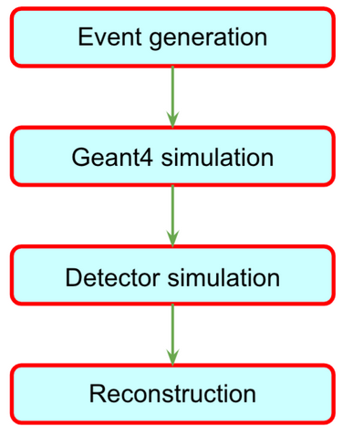

# energyloss

```
      :::       :::    :::   :::   :::   ::::::::::: :::            :::     ::::::::: 
     :+:       :+:    :+:  :+:+: :+:+:      :+:     :+:          :+: :+:   :+:    :+: 
    +:+       +:+    +:+ +:+ +:+:+ +:+     +:+     +:+         +:+   +:+  +:+    +:+  
   +#+       +#+    +:+ +#+  +:+  +#+     +#+     +#+        +#++:++#++: +#++:++#:    
  +#+       +#+    +#+ +#+       +#+     +#+     +#+        +#+     +#+ +#+    +#+    
 #+#       #+#    #+# #+#       #+#     #+#     #+#        #+#     #+# #+#    #+#     
########## ########  ###       ### ########### ########## ###     ### ###    ###   
```



